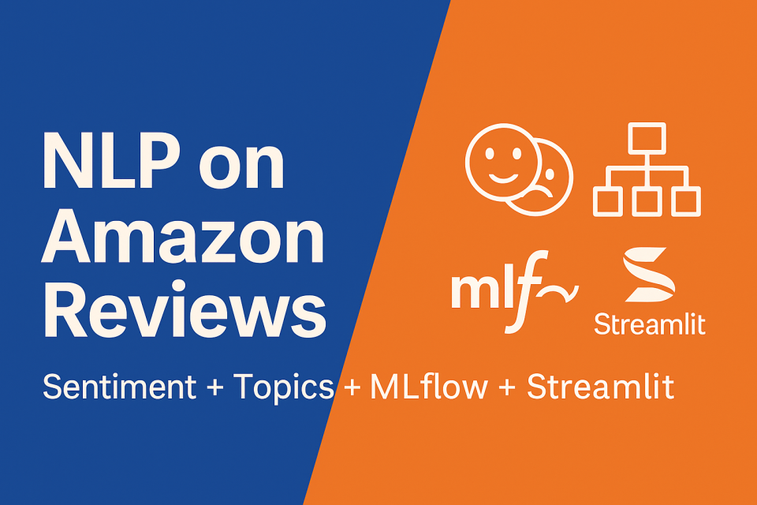
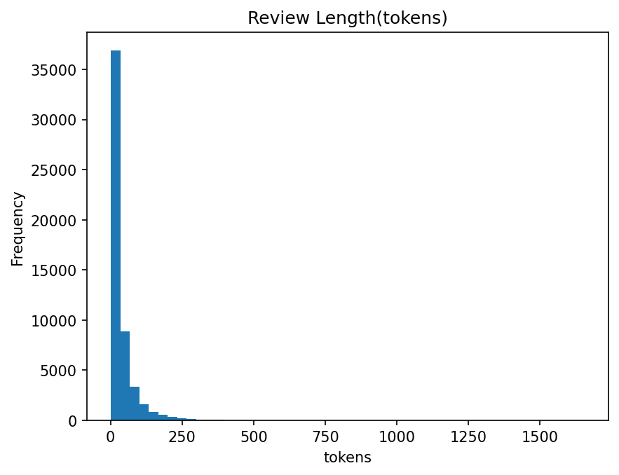
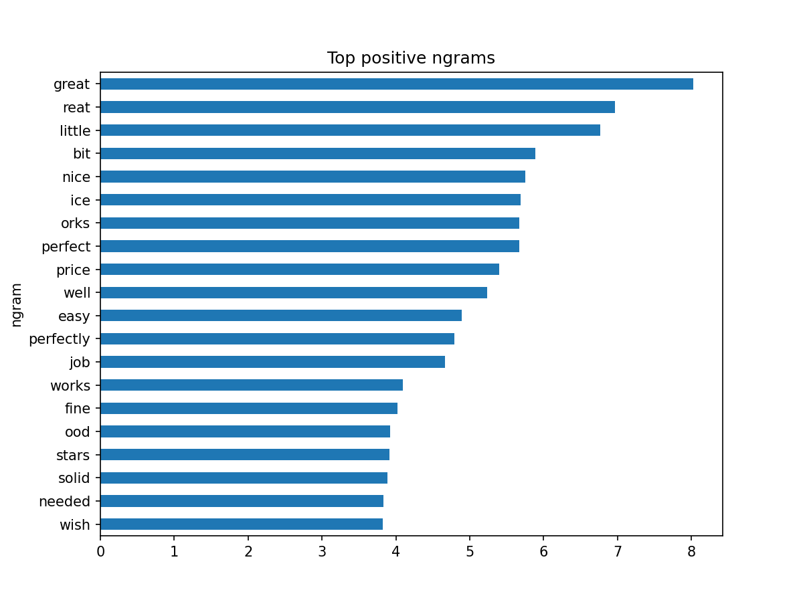
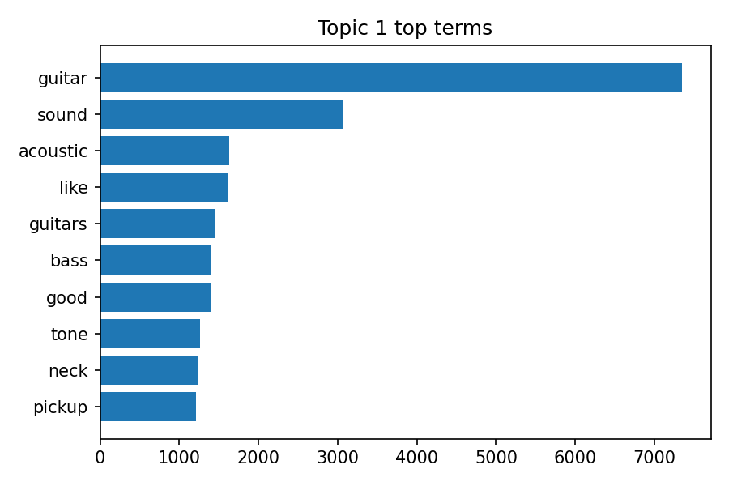
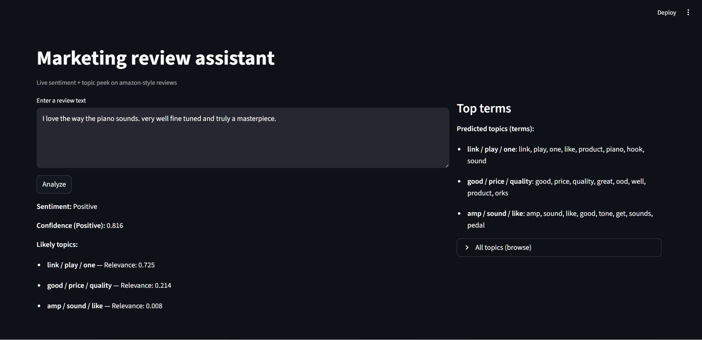
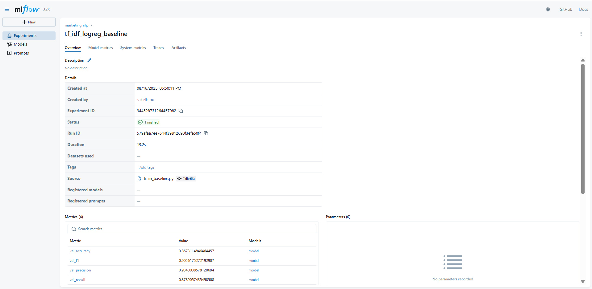

  

End-to-end sentiment + topic insights with MLflow tracking and a Streamlit mini-app.

🚀 What this project does

    Cleans and prepares a public Amazon reviews dataset (category subset).

    Trains a baseline sentiment classifier (TF-IDF + Logistic Regression) with MLflow metrics/artifacts.

    Extracts themes using Topic Modeling (sklearn LDA) and saves topic labels.

    Serves a Streamlit app to analyze reviews: live sentiment + top topic(s) with human-readable names.

    Version-controlled with Git; experiments tracked with MLflow (local by default).

📂 Project structure

    marketing-nlp-amazon/
    ├─ app/
    │  └─ app.py                  # Streamlit UI
    ├─ data/
    │  ├─ raw/                    # downloaded dataset (gitignored)
    │  └─ processed/              # cleaned CSV (gitignored)
    ├─ models/
    │  ├─ baseline_tfidf_logreg.joblib
    │  └─ topics/                 # LDA + vectorizer artifacts
    ├─ notebooks/
    │  ├─ 01_eda.ipynb
    │  └─ 02_introspection.ipynb
    ├─ reports/
    │  ├─ figures/
    |  |  ├─ classification_report_baseline.txt
    |  |  ├─ confusion matrix_baseline.png
    │  │  ├─ eda_label_distribution.png
    │  │  ├─ eda_length_hist.png
    │  │  ├─ eda_top_tokens.csv
    │  │  ├─ eda_top_tokens.png
    │  │  ├─ model_top_positive_ngrams.csv
    │  │  ├─ model_top_pos_bars.png
    │  │  ├─ model_top_negative_ngrams.csv
    │  │  ├─ model_top_neg_bars.png
    │  │  └─ topics/
    │  │     └─ topic_0_top_terms.png ... topic_k_top_terms.png
    │  └─ topics/
    │     ├─ lda_top_terms.csv
    │     ├─ lda_doc_topics.csv
    │     └─ lda_topic_labels.csv
    ├─ src/
    │  ├─ data.py                 # load + clean
    │  ├─ train_baseline.py       # TFIDF + LR + MLflow
    │  └─ topics.py               # LDA + MLflow + labels
    ├─ .gitignore
    ├─ requirements.txt
    └─ README.md

🧰 Setup

    Python: 3.11 recommended (for best package compatibility)
    OS: Windows (PowerShell commands shown); bash equivalents included

    1) Create & activate a virtual env
        
        python -m venv .venv
        .\.venv\Scripts\Activate.ps1

    2) Install dependencies
        pip install -r requirements.txt
        python -m nltk.downloader punkt stopwords
    
📦 Data
    Download a small Amazon Reviews category file [Musical_Instruments_5.json.gz](https://mcauleylab.ucsd.edu/public_datasets/data/amazon_v2/categoryFilesSmall/Musical_Instruments_5.json.gz) and place it in
        
          data/raw/Musical_Instruments_5.json.gz

    The link for Amazon rviews daatset [Amazon reviews](https://cseweb.ucsd.edu/~jmcauley/datasets/amazon_v2/)

▶️ How to run
    
    A) Prepare data (cleaning + labeling)
        python src/data.py
        # output: data/processed/amazon_mi_clean.csv

    B) Train baseline sentiment (TF-IDF + Logistic Regression) with MLflow logging
        python src/train_baseline.py --data data/processed/amazon_mi_clean.csv
        # outputs:
        # - models/baseline_tfidf_logreg.joblib
        # - reports/figures/confusion matrix_baseline.png
        # - reports/figures/classification_report_baseline.txt
        # - MLflow run with metrics + artifacts

    C) Topic modeling (sklearn LDA) + labels + artifacts
        python src/topics.py --data data/processed/amazon_mi_clean.csv --n_topics 10
        # outputs:
        # - models/topics/{count_vectorizer.joblib, lda_model.joblib}
        # - reports/topics/{lda_top_terms.csv, lda_doc_topics.csv, lda_topic_labels.csv}
        # - reports/figures/topics/topic_*.png
        # - MLflow run with metrics (perplexity, topic_diversity) + artifacts
    
    d) Launch the Streamlit app
        streamlit run app/app.py
            Paste any review text and click Analyze to see:
            Sentiment (+ confidence)
            Likely topics (with human-readable names from lda_topic_labels.csv)
            Top terms for the predicted topics
            
📊 MLflow (experiments & artifacts)
Start the UI locally:
    mlflow ui
    Open the printed URL (usually http://127.0.0.1:5000) to view:

    Metrics: val_accuracy, val_precision, val_recall, val_f1, val_auc

    Artifacts: confusion matrix image, classification report, topic CSVs & plots

    Model artifacts logged under model/

    Tip: To track remotely on Azure ML later, set the MLflow tracking URI to your Azure ML workspace; the code already uses standard MLflow APIs.

🖼️ Screenshots

**EDA — Label distribution**  

**EDA — Review length**  

**Model introspection — Top positive n-grams**  

**Model introspection — Top negative n-grams**  

**Topics — Example top terms**  

**Streamlit app**  

**MLflow run**  

✅ Example baseline results

    | Metric    | Value |
    | --------- | ----- |
    | Accuracy  | 0.867 |
    | Precision | 0.934 |
    | Recall    | 0.879 |
    | F1-Score  | 0.906 |
    | AUC       | 0.932 |

🧭 Roadmap

    Hyperparameter search (C, class weights, n-gram ranges)

    Swap TF-IDF → small transformer (e.g., sentence-transformers)

    Better topic labeling (manual curation in lda_topic_labels.csv)

    Azure ML remote tracking + deployment (Project 2)

    Batch scoring API (FastAPI) for reviews

🔒 License
This project is licensed under the MIT License — see the [LICENSE](LICENSE) file for details.
